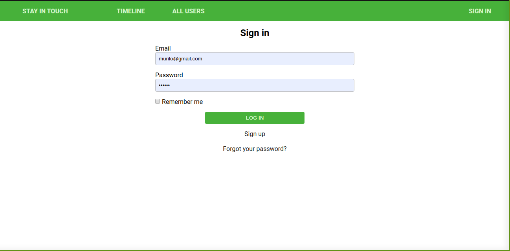

# Scaffold for social media app with Ruby on Rails

> This repo includes intial code for social media app with basic styling. Its purpose is to be a starting point for Microverse students.



## Built With

- Ruby v2.7.0
- Ruby on Rails v5.2.4

## Live Demo

[Click for Live App](https://blooming-stream-41205.herokuapp.com/users/sign_in)


## Getting Started

To get a local copy up and running follow these simple example steps.

### Prerequisites

Ruby: 2.6.3
Rails: 5.2.3
Postgres: >=9.5

### Setup

Instal gems with:

```
bundle install
```

Setup database with:

```
   rails db:create
   rails db:migrate
```


### Usage

Start server with:

```
    rails server
```

Open `http://localhost:3000/` in your browser.

### Run tests
```
    rails db:reset

```

```
   bundle exec rpsec --format documentation
```

> Tests will be added by Microverse students. There are no tests for initial features in order to make sure that students write all tests from scratch.

### Deployment

[Heroku](https://blooming-stream-41205.herokuapp.com/users/sign_in)

## Authors

👤 **Author1**
Aremu Lucky
- Github: [@githubhandle](https://github.com/Luckyaremu)
- Twitter: [@twitterhandle](@luckyaremu)
- Linkedin: [linkedin](https://www.linkedin.com/in/lucky-aremu-24807a145/)

👤 **Author2**
Murilo Roque Paiva da Silva
- Github: [@muriloroque](https://github.com/MuriloRoque)
- Twitter: [@MuriloRoquePai1](https://twitter.com/MuriloRoquePai1)
- Linkedin: [MuriloRoque](https://www.linkedin.com/in/murilo-roque-b1268741/)

## 🤝 Contributing

Contributions, issues and feature requests are welcome!

Feel free to check the [issues page](issues/).

## Show your support

Give a ⭐️ if you like this project!

## Acknowledgments

This is a Microverse project done by students, it was initializated by another student and continuated by us.
