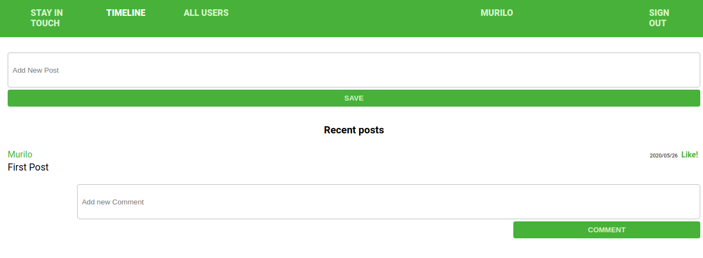

 

# Social media App

In this app, the user can:

- Invite another user to be a friend;
- Accept another user's friend request;
- Write posts and share with friends;
- Comment on a post;
- Like a post or a comment.

## Built With

Ruby on Rails, HTML and SCSS.

## Live Demo

[Click for Live App](https://blooming-stream-41205.herokuapp.com/users/sign_in)

## Getting Started

- Clone the project to your local machine;
- `cd` into the project directory;
- Run `bundle install` to install the necessary gems;
- Run `rails db:create`;
- Run `rails db:migrate`;
- Run `rails s` to start a server in your computer;
- In your browser address, type the following URL: [localhost:3000](localhost:3000);
- Enjoy the App and its functionalities!

## Running RSpec tests

- `cd` into the project directory;
- Run `bundle exec rspec`.

## Authors

👤 **Author1**
Aremu Lucky
- Github: [@githubhandle](https://github.com/Luckyaremu)
- Twitter: [@twitterhandle](@luckyaremu)
- Linkedin: [linkedin](https://www.linkedin.com/in/lucky-aremu-24807a145/)

👤 **Author2**
Murilo Roque Paiva da Silva
- Github: [@muriloroque](https://github.com/MuriloRoque)
- Twitter: [@MuriloRoquePai1](https://twitter.com/MuriloRoquePai1)
- Linkedin: [MuriloRoque](https://www.linkedin.com/in/murilo-roque-b1268741/)

## 🤝 Contributing

Contributions, issues and feature requests are welcome! Start by:

- Forking the project
- Cloning the project to your local machine
- `cd` into the project directory
- Run `git checkout -b your-branch-name`
- Make your contributions
- Push your branch up to your forked repository
- Open a Pull Request with a detailed description to the development branch of the original project for a review

## Show your support

Give a ⭐️ if you like this project!
